# Example Configuration

## Create a Worker

At the beginning you have to define the worker which interacts with one Carte server.

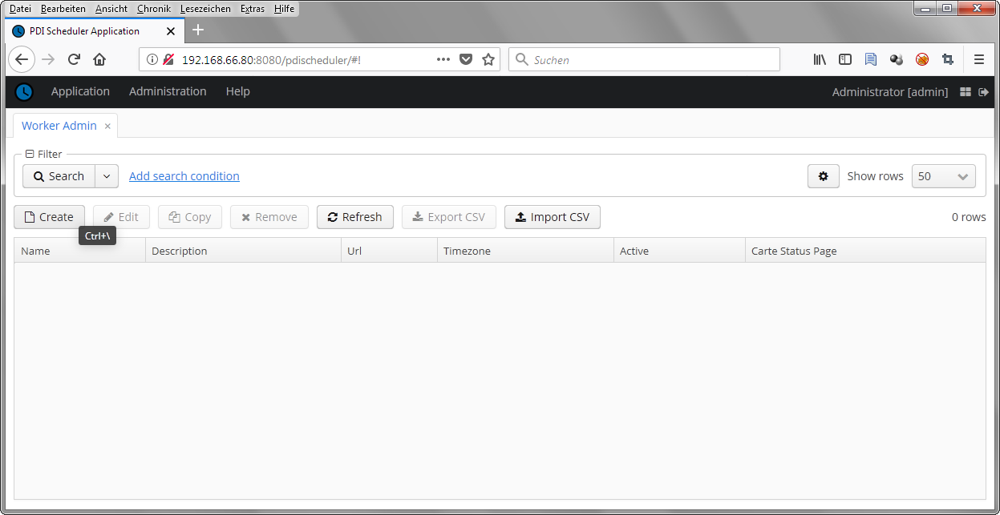

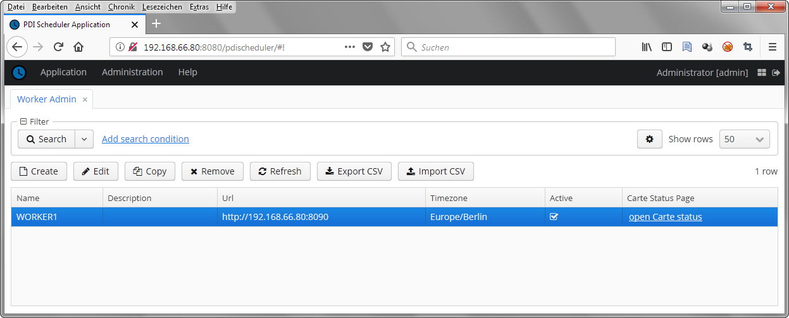

## Create a Project

Next step is to create a first Project which uses above Worker

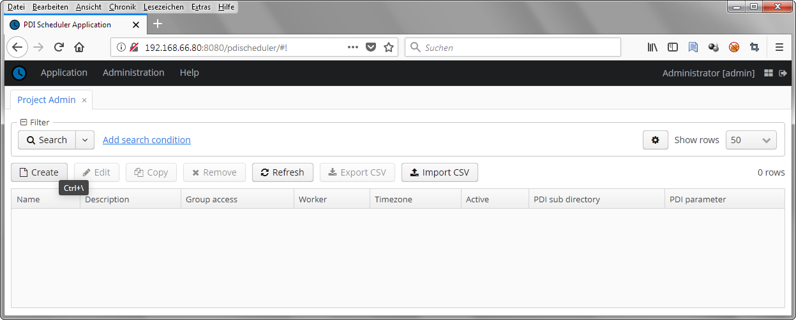

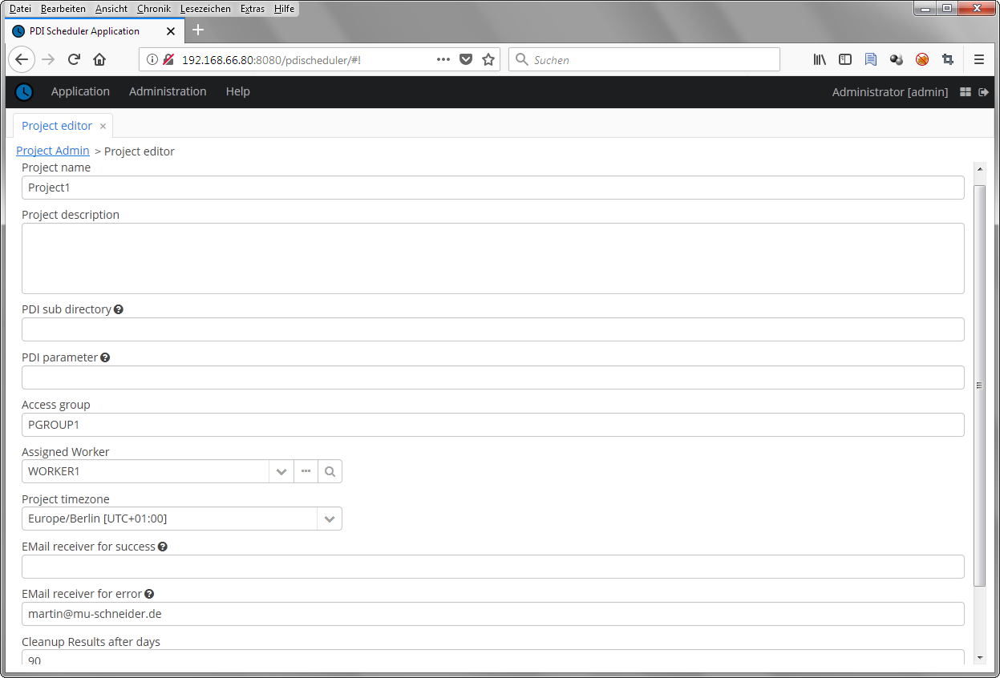

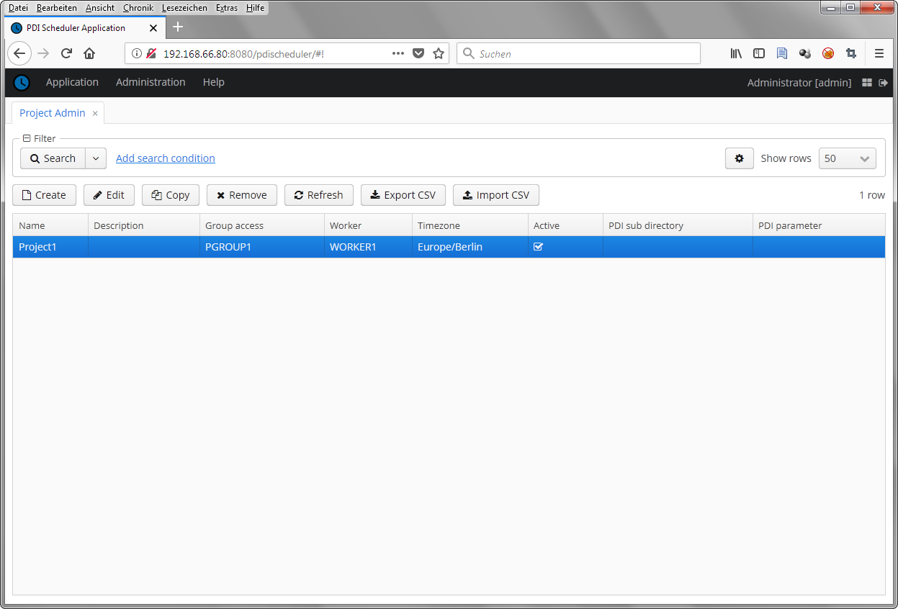

Once an active Project is available, the "Project List" dialog can be used

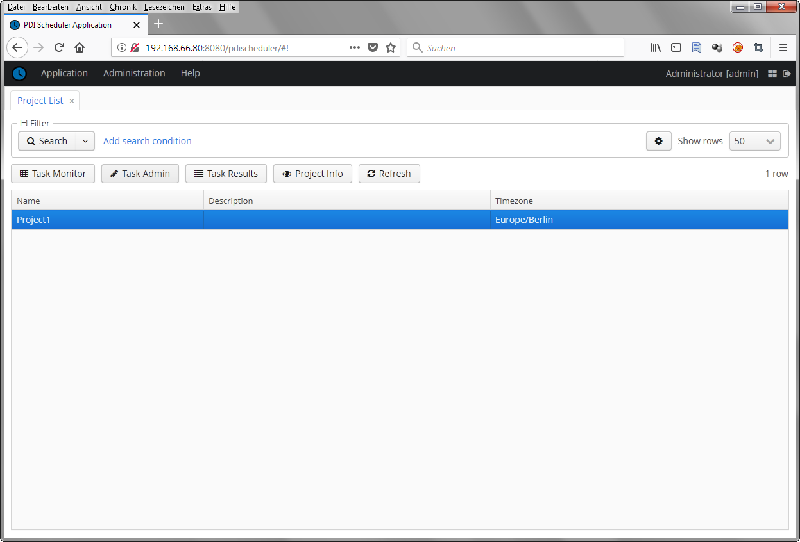

## Create some Tasks

Now you are able to create Tasks at "Task Admin" dialog.

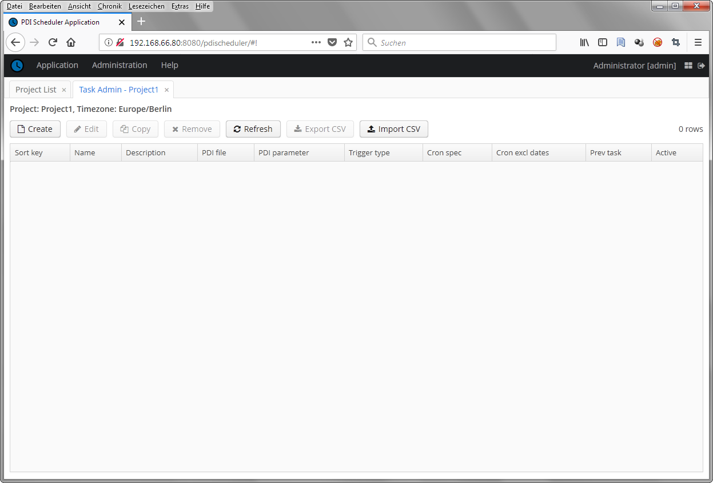

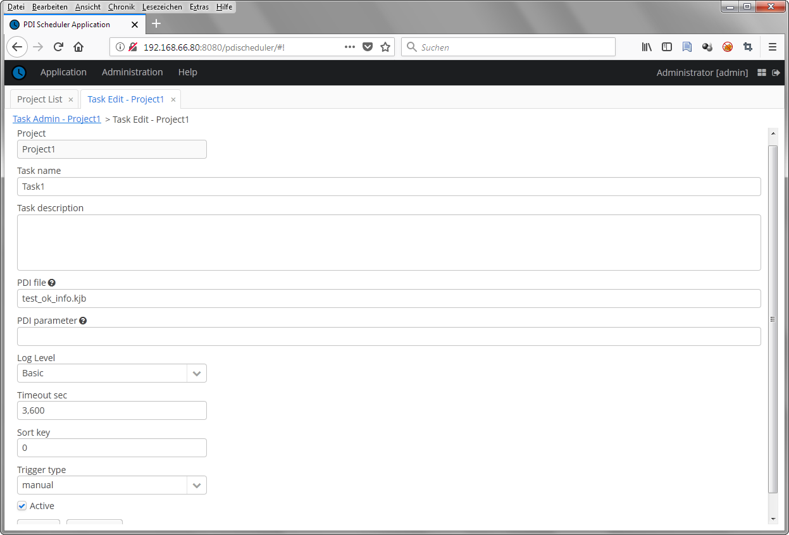

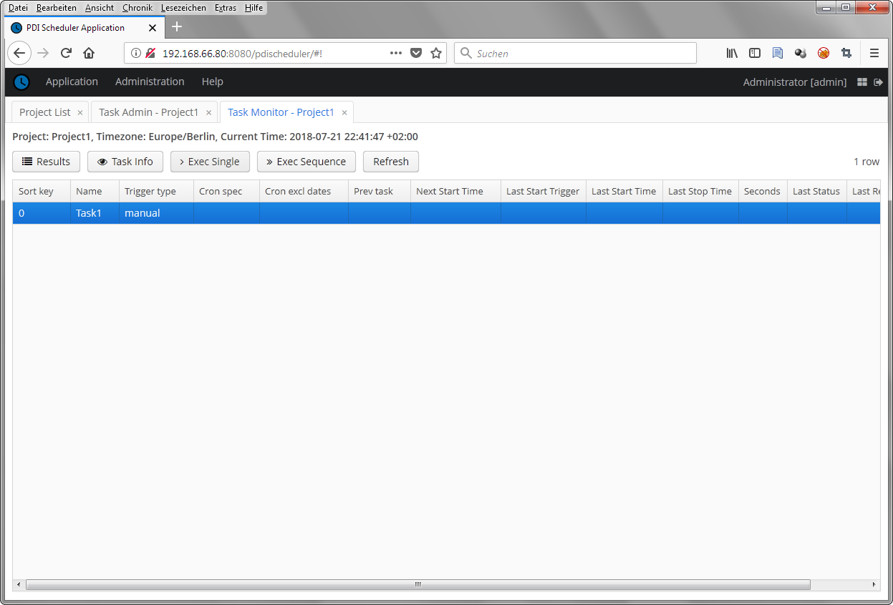

## Monitor and execute Tasks

The "Task Monitor" dialog is probably the most relevant dialog for daily work.
You may start Tasks manually and look at results from last Task execution.
Due to our role model this dialog is seperated from "Task Admin" dialog.

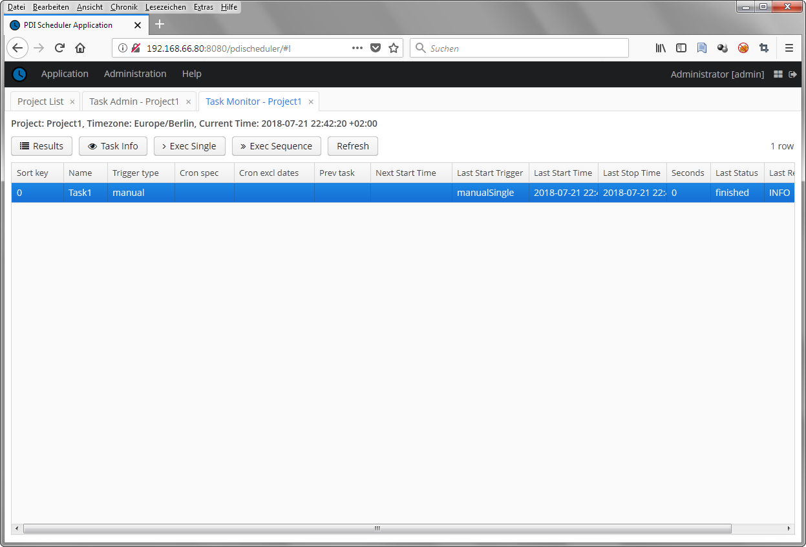

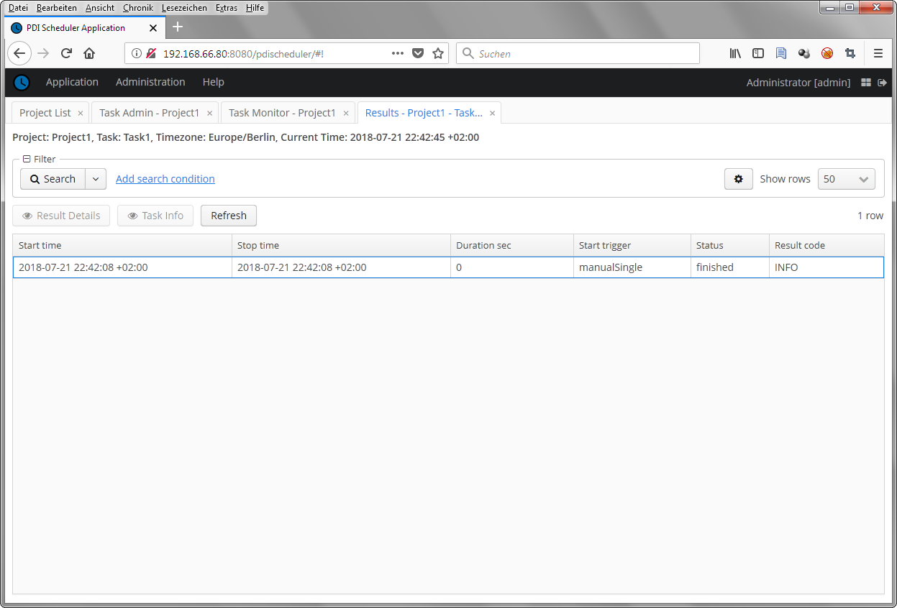

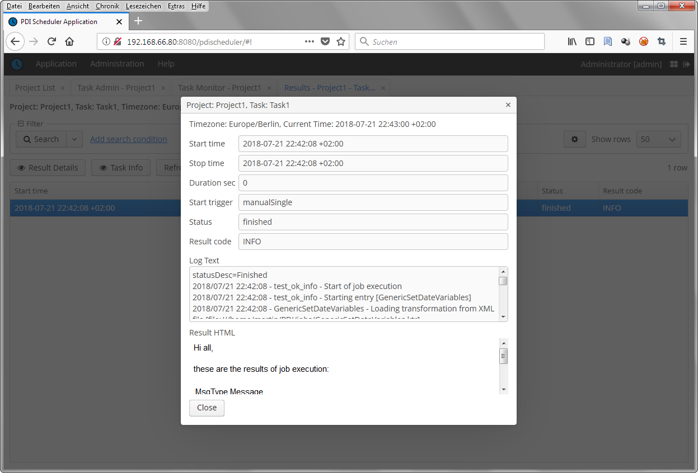

