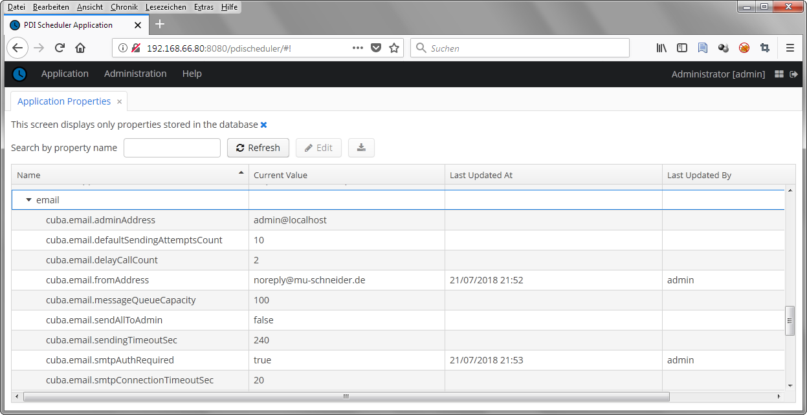
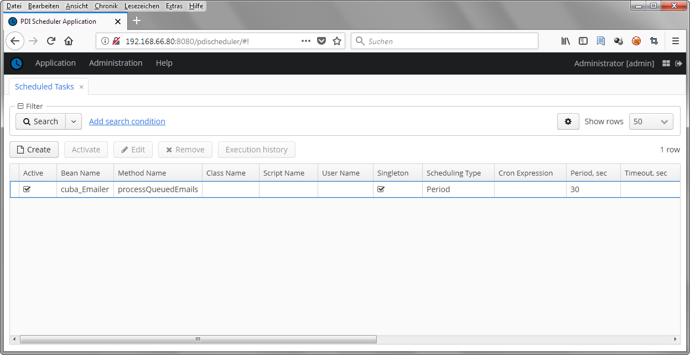
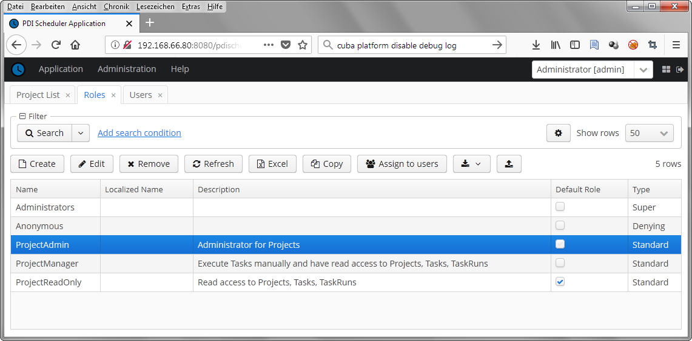
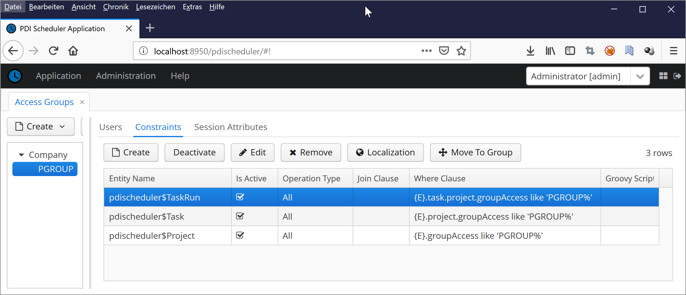
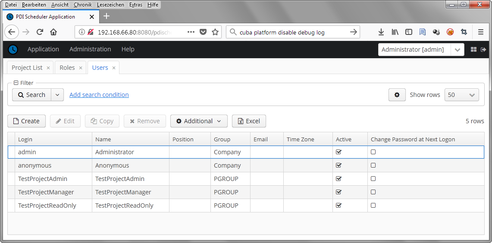
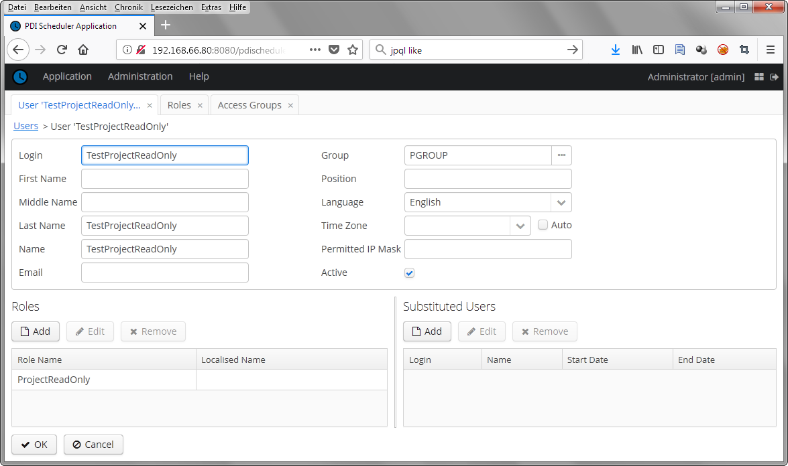
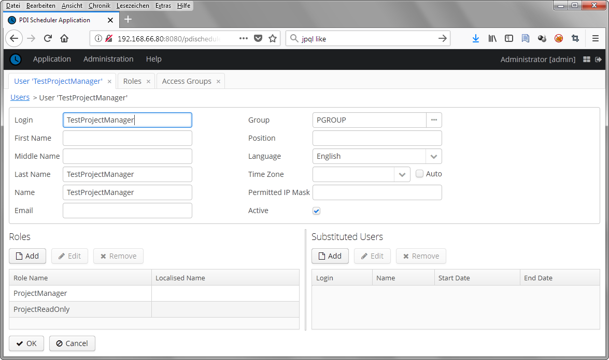
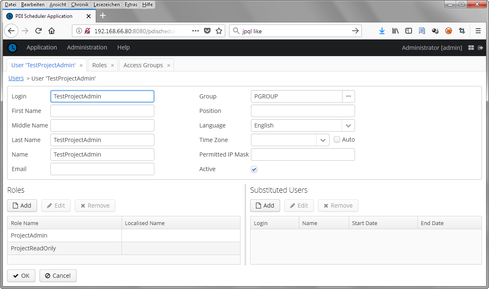

# Install PDI Schedule

## Prerequisites
* Pentaho Data Integration (PDI) Installation\
including running Carte Server\
https://wiki.pentaho.com/display/EAI/Carte+Configuration 

* Postgres DB Installation\
https://www.postgresql.org/docs/current/static/tutorial-install.html

* Tomcat Installation\
https://tomcat.apache.org/download-80.cgi

## Deployment at Tomcat Server
For making installation easy a pdischeduler.war file is provided here for download. It is located at install directory.
This one can be used directly together with a plain Tomcat installation. Only some Postgres 
credentials have to be set at Tomcat/JVM startup.

Of course you may also rebuild the WAR from source by calling "gradlew buildWar" at top level directory.
For more deployment options please refer to documentation of CUBA Platform project.
https://doc.cuba-platform.com/manual-6.9/deployment_variants.html

### Create new user at Postgres DB

Login at your Postgres DB from command line:

psql -U postgres

    CREATE USER pdischeduler WITH
      LOGIN
      NOSUPERUSER
      INHERIT
      NOCREATEDB
      NOCREATEROLE
      NOREPLICATION;

    ALTER USER pdischeduler WITH PASSWORD '<choose a good one>';

    CREATE DATABASE pdischeduler
      WITH
      OWNER = pdischeduler
      ENCODING = 'UTF8'
      LC_COLLATE = 'de_DE.UTF-8'
      LC_CTYPE = 'de_DE.UTF-8'
      TABLESPACE = pg_default
      CONNECTION LIMIT = -1;

Now you should be able to login with SQL Client and user pdischeduler

### Install WAR at Tomcat

If you want to deploy to Tomcat at an Ubuntu system, you probably start with 

    sudo apt-get install tomcat8

After installation you have to set Postgres DB credentials during startup

    cd /usr/share/tomcat8/bin/
    sudo vi setenv.sh
         #!/bin/sh
         # Set some standards
         export CATALINA_OPTS="$CATALINA_OPTS -Xmx1024m -Duser.timezone=UTC -Dfile.encoding=UTF-8"
         #
         # Within pdischeduler.war a generic context.xml is packaged which contains variables for Postgres DB connection:
         # Please set for your needs
         export CATALINA_OPTS="$CATALINA_OPTS -Dpg.url='jdbc:postgresql://<servername>/<username>?ssl=true&sslfactory=org.postgresql.ssl.NonValidatingFactory' -Dpg.user=<username> -Dpg.pass=<password>"

Now copy war file to webapps

    sudo cp pdischeduler.war /var/lib/tomcat8/webapps/
    sudo chown tomcat8.tomcat8 /var/lib/tomcat8/webapps/pdischeduler.war
    
Startup is done by

    sudo service tomcat8 start

You should check protocol by 
    
    less /var/lib/tomcat8/logs/catalina.out

During first startup the Postgres DB will be initialized automatically.
After startup the application should be available at

    http://<server>:8080/pdischeduler/

For first login use user "admin" with password "admin". Please change this!

### Base Configuration from inside the application

Now you have to configure the "Application Properties" from "Administration" Menu.
You have to set SMTP credentials to allow email sending for protocols:

    cuba.email.smtpHost = ...
    cuba.email.smtpStarttlsEnable = true
    cuba.email.smtpAuthRequired = true
    cuba.email.smtpUser = ...
    cuba.email.smtpPassword = ...
    cuba.email.fromAddress = ...
    cuba.email.adminAddress = ...

You also have to add a "Scheduled Tasks" from "Administration" Menu which asynchronously send out the emails.
This one has nothing to do with the PDI jobs itself.

    Bean Name = cuba_Emailer
    Method Name = processQueuedEmails
    Singleton = activate
    Scheduling Type = Period
    Period. sec = 30

Save it and after this Activate the Task.

## Role and Group initialization 

At "Administration" -> "Roles" Menu you should import the InitialRoles.json from install directory.
These roles may be assigned to users later to restrict access level.

There is also a InitialGroups.json example file which may be imported at "Administration" -> "Groups".
This creates a sample PGROUP group which can be assigned to user for restrict access to specific projects.
Within Constraint - Where Clause you check project.groupAccess with specific specified value.
 

## Add some test user with restricted rights. 

Now you may start with an example [here](EXAMPLE.md)